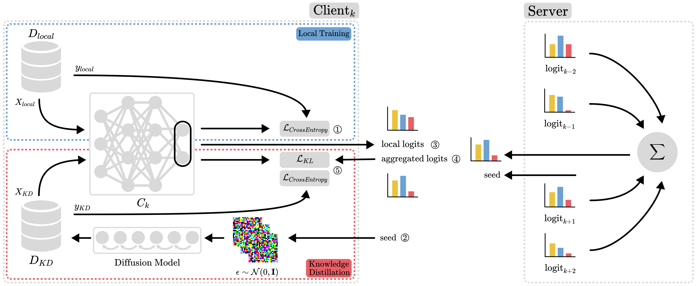

# FedKDD: Federated Learning with Diffusion-based Knowledge Distillation in Heterogeneous Networks


Master's Dissertation supervised by Dr. Zhongguo Li
    


## Abstract

Federated Learning (FL) has recently emerged as a promising solution to alleviate data privacy issues of increasingly prominent machine learning models, while facilitating collaboration. However, the requirement of a single common model for all clients has constrained implementations due to device heterogeneity as well as intellectual property protection. Research has shown that Knowledge Distillation (KD) can be leveraged as an alternative to model aggregation schemes with heterogeneous model through the use of a proxy dataset. In parallel, the development of Diffusion Models (DM) has demonstrated impressive capabilities to generate diverse and representative synthetic datasets, paving the way for potential synergy with KD strategies. The main contributions are two-fold: the development of one of the pioneering DM training methods using FL and the introduction of a novel FL algorithm, FedDKD, which trains heterogeneous models collaboratively with KD performed on synthetic data generated by the DM. The proposed methods are evaluated on EMNIST and CINIC-10 with homogeneous and heterogeneous data setting, as well as benchmarked on two heterogeneous model strategies to evaluate its robustness. Results show that with careful parameter consideration and tuning, FedDKD can yield improvements up to 37.49% on EMNIST with CNN models and up to 4.82% on CINIC-10 with ResNets compared to local training. 

## Requirements
Install all the packages from environment.yml file using conda:

```
conda env create -f environment.yaml
```

## Data
* Download train and test datasets using the ```download.sh``` script in the ```dataset/``` directory.
* To use your own dataset: Move your dataset to ```dataset/``` directory and modify ```Dataset``` class accordingly.

## Running the experiments
The baseline experiment trains the model in the conventional way.

* To run the baseline experiment on CINIC-10 dataset with ```ResNet32``` server model and hetergeneous ```ResNet``` clients, run the following command:

```
python main.py --dataset-id cinic10 --data-path dataset/cinic-10 --data-partition dirichlet --server-model resnet32 --client-model strategy_1
```

You can change the default values of other parameters to simulate different conditions. Refer to the options section.

## Options
Training parameters and other options can be set in the ```main.py``` file. The following options are available:

* ```--dataset-id:```  Name of target dataset. Default: 'cifar10'. Options: 'cifar10', 'cinc10', 'emnist'
* ```--data-path:```    Path to the directory containing the dataset.
* ```--data-partition:```   Dataset splitting method. Default: 'iid'. Options: 'iid', 'dirichlet', 'random'
* ```--server-model:```   Model for server. Default: 'resnet32'. Options: 'resnet32', 'resnet18', 'mobilenetv3', 'shufflenetv2', 'vgg'
* ```--client-model``` Model for server. Default: 'resnet'. Options: 'heterogeneous_random', 'homogeneous_random', 'homogenous', 'cnn_1', 'resnet' (see ```ClientModelStrategy```)
* ```--epochs:```   Number of rounds of training. Default: 10
* ```--kd-epochs:```   Number of rounds of knowledge distillation. Default: 10
* ```--batch-size:```   Batch size for training. Default: 32
* ```--kd-batch-size:```   Batch size for knowledge distillation. Default: 32
* ```--num-rounds:```   Number of communication rounds. Default: 10
* ```--num-clients:```   Number of clients. Default: 5
* ```--load-diffusion:```   Load diffusion model from file. Default: True
* ```--save-checkpoint:```   Save checkpoint of the model. Default: False